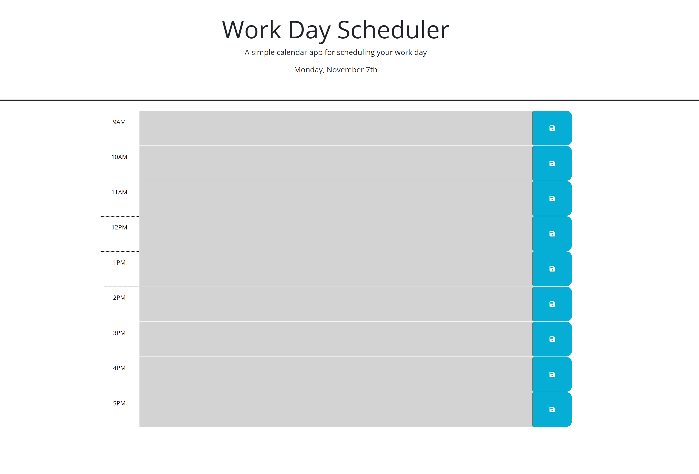

# Module5 Challenge: Work Day Calendar

## Description

Write javascript code using jquery to update a daily calendar to display hours of the day that are either in the past, present or future. Allow for user input of tasks to be completed during each hour of the workday. The text input can then be saved to local storage and will be displayed upon page reload.

## Tasks accomplished

<ul>
    <li>Used dayjs to provide the current time and compare to the calendar to show which events are in the past present and future.</li>
    <li>Used jquery DOM manipulation to create styling for each hour of the day based on if its in the past, present or future.</li>
    <li>Used local storage and jquery to store user input in the text field for each hour, and display the stored text upon page reload.</li>
</ul>

## Website Link

Link to deployed website is [Work Day Calendar](https://larsonrj.github.io/dailyCalendar/)

## Website Preview

